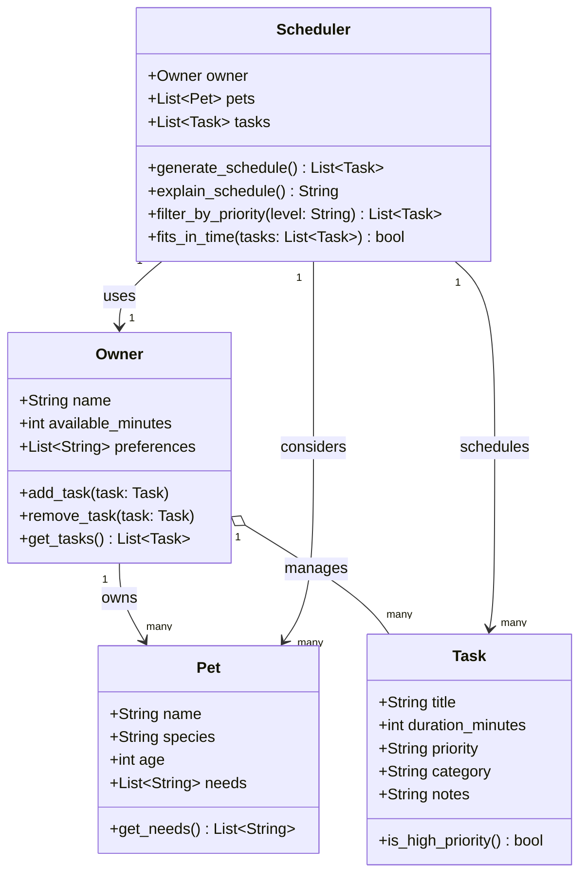

# PawPal+ UML Class Diagram

## Relationship Notes

| Relationship | Type | Multiplicity | Description |
|---|---|---|---|
| Owner → Pet | Association | 1 to many | An owner can have multiple pets |
| Owner ◇→ Task | Aggregation | 1 to many | Owner manages tasks; tasks exist independently |
| Scheduler → Owner | Dependency | 1 to 1 | Scheduler uses owner constraints (time, preferences) |
| Scheduler → Pet | Dependency | 1 to many | Scheduler considers each pet's needs |
| Scheduler → Task | Dependency | 1 to many | Scheduler selects and orders tasks into a daily plan |
