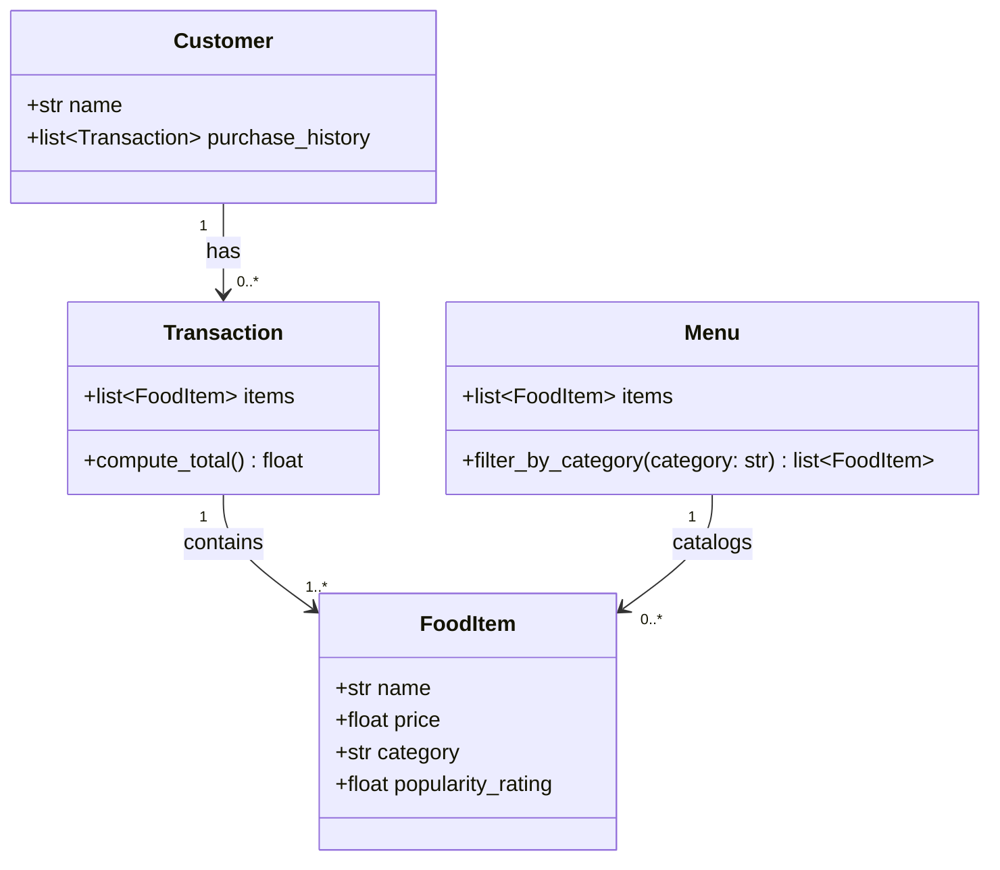

```mermaid
classDiagram
    class Customer {
        +str name
        +list~Transaction~ purchase_history
    }

    class FoodItem {
        +str name
        +float price
        +str category
        +float popularity_rating
    }

    class Menu {
        +list~FoodItem~ items
        +filter_by_category(category: str) list~FoodItem~
    }

    class Transaction {
        +list~FoodItem~ items
        +compute_total() float
    }

    Customer "1" --> "0..*" Transaction : has
    Transaction "1" --> "1..*" FoodItem : contains
    Menu "1" --> "0..*" FoodItem : catalogs
```
